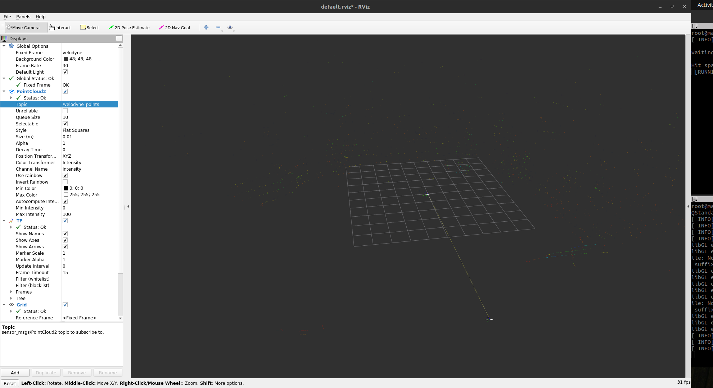
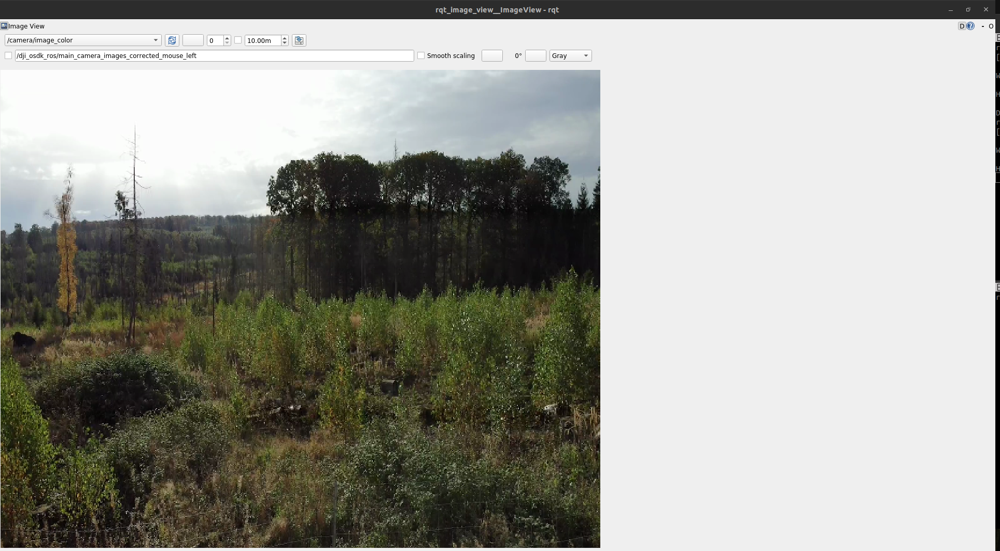
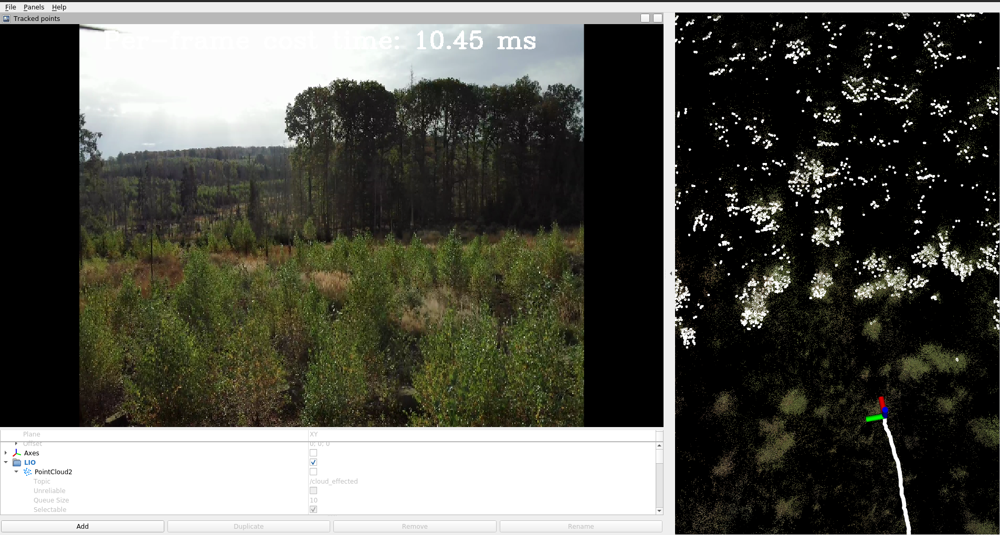

## Introduction

[**R3LIVE**](https://github.com/hku-mars/r3live?tab=readme-ov-file) (Robust, Real-time, RGB-colored, LiDAR-Inertial-Visual tightly-coupled Estimation) is a state-of-the-art framework for real-time 3D mapping and localization. It tightly fuses data from LiDAR, inertial measurement units (IMUs), and RGB cameras to create dense, RGB-colored 3D maps of the environment. 

This repository provides a **wrapper package** that bridges the gap between custom ROS bags coming from our labs and R3LIVE. Our wrapper converts ROS bag files containing LiDAR, IMU, and camera data into a format that R3LIVE can process. This allows  to easily integrate their existing sensor data with R3LIVE for real-time mapping and localization.

---

### Key Features of the Wrapper Package
- **ROS Bag Conversion**: Converts LiDAR, IMU, and camera data from our ROS bags into R3LIVE-compatible formats.
- **Sensor Synchronization**: Ensures proper synchronization of LiDAR, IMU, and camera data streams.
---

### Example Workflow
1. **Record Sensor Data**: Use ROS to record LiDAR, IMU, and camera data into a ROS bag.
2. **Convert Data**: Use our wrapper package to convert the ROS bag into R3LIVE-compatible formats.
3. **Run R3LIVE**: Feed the converted data into R3LIVE for real-time 3D mapping and localization.

## Prerequisites

To use this project, you need the following prerequisites:

---

### 1. **Docker**
Install Docker on your system to build and run the containerized environment. Follow the official Docker installation guide for your operating system:
- [Install Docker on Ubuntu](https://docs.docker.com/engine/install/ubuntu/)
- [Install Docker on Windows](https://docs.docker.com/desktop/install/windows-install/)
- [Install Docker on macOS](https://docs.docker.com/desktop/install/mac-install/)

---

### 2. **ROS Noetic (Optional)**
If you prefer not to use Docker, you can set up ROS Noetic directly on your system. Follow the official ROS Noetic installation guide:
- [ROS Noetic Installation](http://wiki.ros.org/noetic/Installation)

---

### 3. **Input Files**
The following files are required to build and run the Docker container:
- **`python_packages.txt`**: Lists Python packages and their versions.
- **`requirements.txt`**: Lists system packages to install via `apt-get`.
- **`repo_urls.txt`**: Contains the URLs of GitHub repositories to clone.

These files are automatically used by the Dockerfile to set up the environment.

---

### 4. **Dockerfile**
The provided `Dockerfile` sets up a ROS Noetic environment with all necessary dependencies. It performs the following steps:
- Installs system packages listed in `requirements.txt`.
- Installs Python packages listed in `python_packages.txt`.
- Clones GitHub repositories listed in `repo_urls.txt`.
- Builds the ROS workspace using `catkin_make`.

To build the Docker image, run:
```bash
docker build -t ros-custom-image .
```
To run the container, use:
```bash
docker run -it --rm ros-custom-image
```
### 5. Entrypoint Script
The entrypoint.sh script is used to:

- Source the ROS environment.
- Source the catkin workspace.

This script ensures that the ROS environment is properly set up when the container starts.

### 6. NVIDIA GPU Support
To leverage GPU acceleration, install the [NVIDIA Container Toolkit](https://docs.nvidia.com/datacenter/cloud-native/container-toolkit/latest/install-guide.html). Then, build and run the Docker container with GPU support:
```bash
docker build -t ros-custom-image .
docker run -it --rm --gpus all ros-custom-image
```

## Data Conversion

---

### 1. **Point Cloud Conversion (`pointcloud_transfer_node.py`)**
This script converts ROS `PointCloud2` messages (LiDAR data) into the format required by R3LIVE.

#### Key Features:
- Subscribes to the `/velodyne_points` topic (or any LiDAR topic).
- Converts `PointCloud2` messages into a custom format.
- Publishes the converted data to the `/livox/lidar` topic.

#### Usage:
```bash
rosrun r3live_wrapper pointcloud_transfer_node.py
```

### 2. **IMU Conversion (`imu_transfer_node.py`)**
This script converts ROS Imu messages (IMU data) into the format required by R3LIVE.

#### Key Features:
- Subscribes to the /dji_osdk_ros/imu topic (or any IMU topic).
- Converts Imu messages into a custom format.
- Publishes the converted data to the /livox/imu topic.
#### Usage:
```bash
rosrun r3live_wrapper imu_transfer_node.py
```

### 3. **Image Conversion (`image_transfer_node.py`)**
This script converts ROS `Image` messages (camera data) into the format required by R3LIVE.

#### Key Features:
- Subscribes to the /dji_osdk_ros/main_camera_images topic (or any camera topic).
- Converts Image messages into a custom format.
- Publishes the converted data to the /camera/image_color topic.
#### Usage:
```bash
rosrun r3live_wrapper image_transfer_node.py
```

## Run an example
#### enable docker gui:
```bash
sudo xhost +local:docker
```
### create docker container and run roscore and jupyter lab inside it:
```bash
sudo docker run -it --rm --name ros-jupyter \
    -p 11311:11311 -p 8888:8888 \
    -e DISPLAY=$DISPLAY -v /tmp/.X11-unix:/tmp/.X11-unix \
    --net=host --runtime=nvidia \
    noetic_ros_r3live:v1 /bin/bash

tmux new-session -d -s ros "roscore"
tmux new-session -d -s jupyter "jupyter lab --ip=0.0.0.0 --port=8888 --no-browser --allow-root"
```
### run the ros bag file:
```bash 
rosbag play snippet1.bag
```
### visualize the LiDAR data:
```bash
rosrun rviz rviz
rosrun tf2_ros static_transform_publisher 0 0 0 0 0 0 body velodyne
```

### visualize the camera data:
```bash
rqt_image_view
```

### running the bag wrapper node
```bash
rosrun r3live_wrapper bag_converter_node.py
```
### create the map
```bash
roslaunch r3live r3live_bag.launch
```

### reconstruct and visualize the mesh
```bash
roslaunch r3live r3live_reconstruct_mesh.launch
cd ${HOME}/r3live_output
pcl_viewer rgb_pt.pcd
meshlab textured_mesh.ply
```