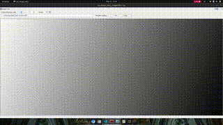
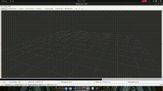
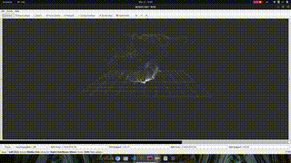

## r3live_wrapper ros package
* The aim of this package is to wrap the input topics and messages which we are interested in to a format that can be run by r3live.

| Sensor             | Our topic and message                                | r3live target topic and message                               |
|--------------------|------------------------------------------------------|---------------------------------------------------------------|
| Camera             | /dji_osdk_ros/main_camera_images: sensor_msgs/Image  | /camera/image_color/compressed: sensor_msgs/CompressedImage   |
| LiDAR              | /velodyne_points: sensor_msgs/PointCloud2            | /livox/lidar: livox_ros_driver/CustomMsg                      |
| IMU                | /dji_osdk_ros/imu: sensor_msgs/Imu                   | /livox/imu : sensor_msgs/Imu                                  |

## package building
```bash
cd /catkin_ws/src
```
```bash
git clone -b ros_wrapper --single-branch https://github.com/HBRS-SDP/ws24-lidar-camera-fusion.git
```
```bash
cd /catkin_ws
```
```bash
catkin_make
```
### image transfer node:
* Listens for images on /dji_osdk_ros/main_camera_images
* Converts them to OpenCV format with RGB8 encoding
* Resizes them to 640x512
* Republishes them on /camera/image_color with the same headers
- example :
```bash
rosbag play rosbag play snippet1.bag
```
```bash
rosrun r3live_wrapper image_transfer_node.py
```
```bash
rqt_image_view
```

### pointcloud transfer node:
our velodyne_points topic has its data in the format of PointCloud2 which can be understood by rviz, so we begin with visualizing it:
```bash
rosbag play snippet1.bag
```
```bash
rosrun tf2_ros static_transform_publisher 0 0 0 0 0 0 body velodyne
```
```bash
rosrun rviz rviz
```

* Listens for point clouds on /velodyne_points (Velodyne format)
* Converts them to Livox's CustomMsg format
* Republishes them on /livox/lidar
* Key conversion steps include:
    * Preserving the message header
    * Converting each point's coordinates
    * Mapping intensity to reflectivity
    * Setting default values for Livox-specific fields
    * Maintaining point count

### livox to pointcloud node:
The main aim of this node is to transfer the livox data which are cusom message to a PointCloud2 format so that we can visualize them in rviz.
```bash
rosrun r3live_wrapper livox_to_pointcloud.py
```
```bash
rosbag play hku_park_00.bag
```
```bash
rosrun tf2_ros static_transform_publisher 0 0 0 0 0 0 map camera_init
```
```bash
rosrun rviz rviz
```


### bag converter node:
The main node, converts and records multiple sensor data streams (images, IMU, point clouds) from one format to another while saving them to a ROS bag file.

* Subscribes to three source topics:
    * DJI camera images
    * DJI IMU data
    * Velodyne point clouds

* Converts each to target formats:
* Resizes and reformats images
* Converts point clouds to Livox format
* Passes IMU through unchanged
* Publishes converted data to new topics
* Records all converted data to a ROS bag file 

## How to run an example :
* run the wrapper node :
```bash 
rosrun r3live_wrapper bag_converter_node.py
```
* play the recorded bag
```bash
rosbag play snippet1.bag
```
* the output bag will be saved at the /ros_bags directory, run it
```bash
rosbag play output.bag
```
* launch r3live mapping:
```bash
roslaunch r3live r3live_bag.launch
```
* the output map will be saved in ~/r3live_outputs, to visualize it
```bash
pcl_viewer rgb_pt.pcd
```
* to generate the mesh
```bash
roslaunch r3live r3live_reconstruct_mesh.launch
```
```bash
meshlab textured_mesh.ply
```
